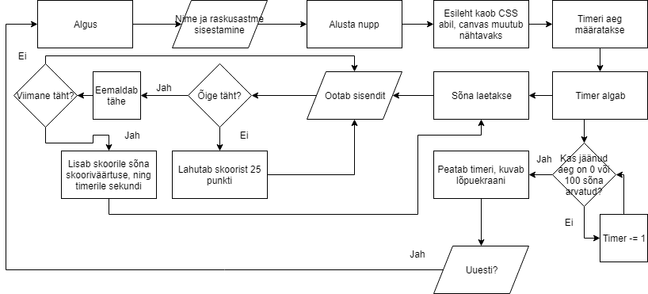

# 2. kodutöö – kirjutamise mängu täiendamine

Mängu eesmärk on võimalikult kiiresti ekraanile tekkivaid sõnu ära trükkida. Sõnad on võetud [Eesti Keele Instituudi lehelt](http://www.eki.ee/tarkvara/wordlist/) – [lemmad2013](http://www.eki.ee/tarkvara/wordlist/lemmad2013.txt). Aluseks tuleb võtta kood **[eesrakenduste-arendamine-2018k/klahvimine](https://github.com/eesrakenduste-arendamine-2018k/klahvimine)**. 

Nimed: Karl Erik Raid, Erik Enden, Raili Miksaar

## Funktsionaalsus

Alguses lubab mäng sisestada mängija nime ning valida raskusastme, mis mõjutab mängimiseks antud aega. Iga sõna saab genereerimise käigus punktiväärtuse, mis moodustub tähtede arvu korrutamisest 25-ga. Iga vale klahvivajutus lahutab skoorist 25 punkti. Samuti jälgib mäng ka pihta- ja möödavajutusi ning arvutab nende põhjal täpsusprotsendi. Lõpus näitab mäng lõppenud mängu ning 25 parima mängija statistikat tabelina (localStorage põhiselt). 

